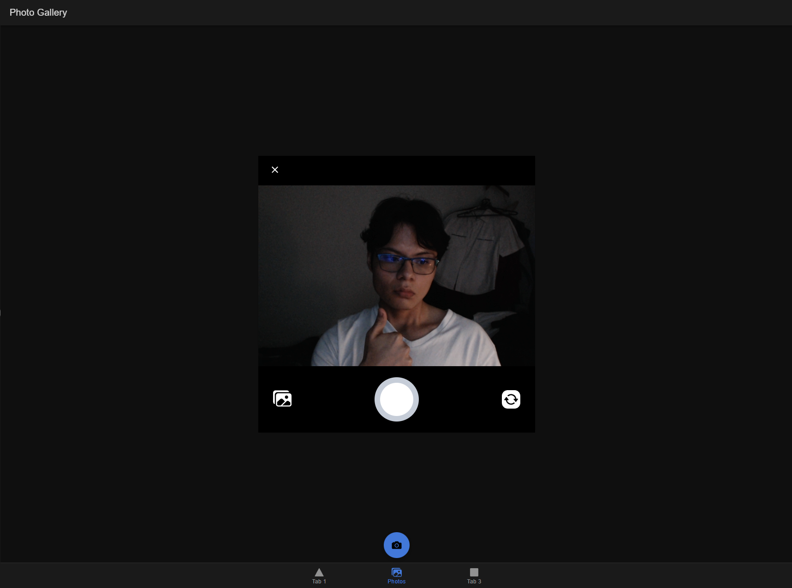
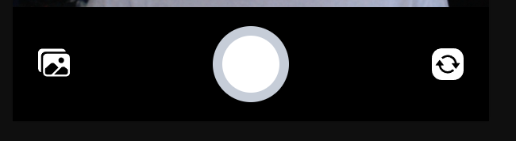
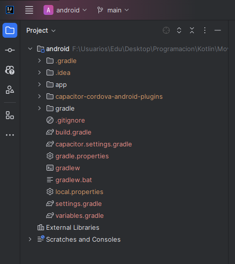
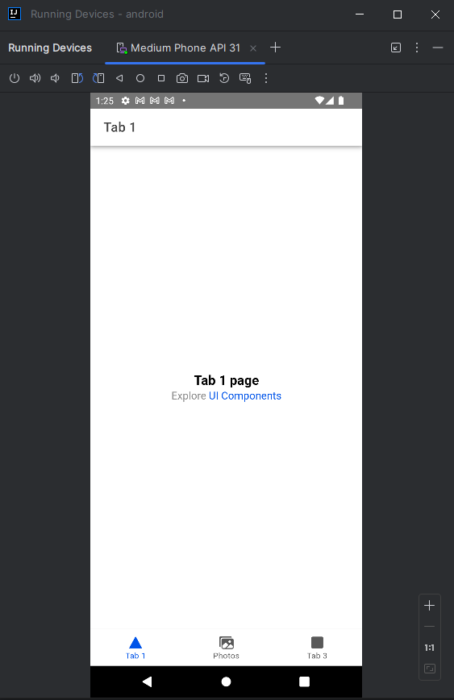
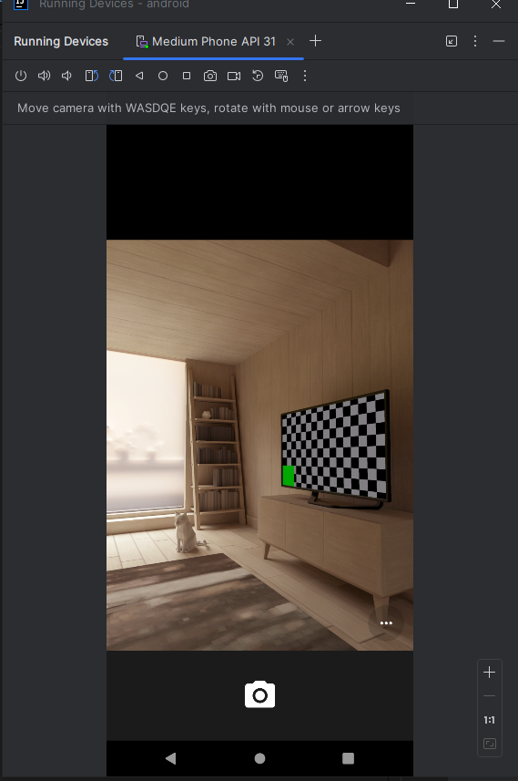
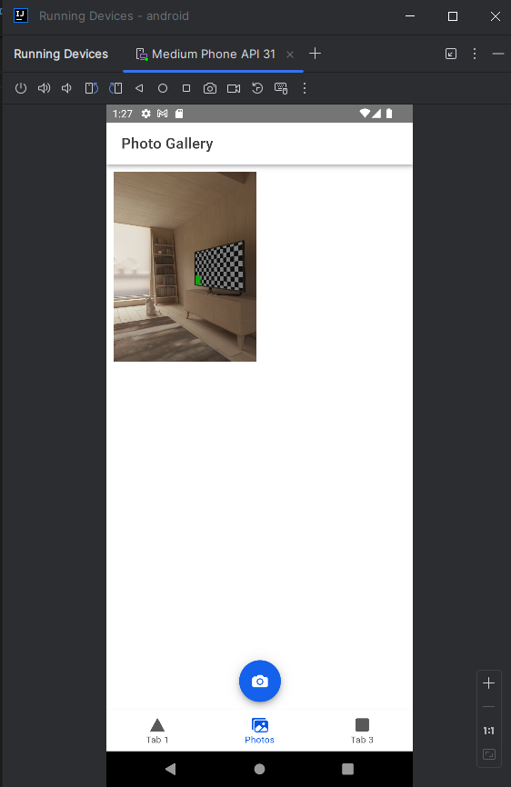

# Pacheco Cruz Eduardo | 6NM61 |

## COMPRESION IONIC

### Instalación de Ionic

```bash
npm install -g @ionic/cli
```

Iniciar un proyecto de ionic

```bash
ionic start photo-gallery tabs --type=angular --capacitor
```

Iniciar el proyecto

```bash
ionic serve
```

### Editamos tabs2.page.html

```html
<ion-header [translucent]="true">
  <ion-toolbar>
    <ion-title>Photo Gallery</ion-title>
  </ion-toolbar>
</ion-header>

<ion-content>
  <ion-fab vertical="bottom" horizontal="center" slot="fixed">
    <ion-fab-button (click)="addPhotoToGallery()">
      <ion-icon name="camera"></ion-icon>
    </ion-fab-button>
  </ion-fab>
</ion-content>
```

Tambien editamos tabs.page.html

```html
<ion-tabs>
  <ion-tab-bar slot="bottom">
    <ion-tab-button tab="tab1" href="/tabs/tab1">
      <ion-icon aria-hidden="true" name="triangle"></ion-icon>
      <ion-label>Tab 1</ion-label>
    </ion-tab-button>

    <ion-tab-button tab="tab2" href="/tabs/tab2">
      <ion-icon name="images"></ion-icon>
      <ion-label>Photos</ion-label>
    </ion-tab-button>

    <ion-tab-button tab="tab3" href="/tabs/tab3">
      <ion-icon aria-hidden="true" name="square"></ion-icon>
      <ion-label>Tab 3</ion-label>
    </ion-tab-button>
  </ion-tab-bar>
</ion-tabs>
```

### Creamos el Photo Service

```bash
ionic g service services/photo
```

Y lo editamos segun el codigo de la pagina de ionic

https://ionicframework.com/docs/angular/your-first-app/taking-photos

Y al final activamos la camara:



### Displaying Photos

Volvemos a editar photo.service.ts

```typescript
export interface UserPhoto {
  filepath: string;
  webviewPath?: string;
}
//Otro codigo
```

Y agregando más codigo

Quedando la camara de la siguiente manera:



### Guardar las fotos

Seguimos editando photo.service.ts
Como en la pagina de ionic
https://ionicframework.com/docs/angular/your-first-app/saving-photos

### Desplegar en iOS y Android

```bash
ionic build
```

Ahora creamos los proyectos para android y ios

```bash
ionic cap add ios
ionic cap add android

ionic cap copy
ionic cap sync
```

#### iOS deployment

**Nota:** Solo se puede hacer en una Mac

```bash
ionic cap open ios
```

#### Android deployment

```bash
ionic cap open android
```

Podemos abrir el proyecto en IntelliJ y compilarlo





